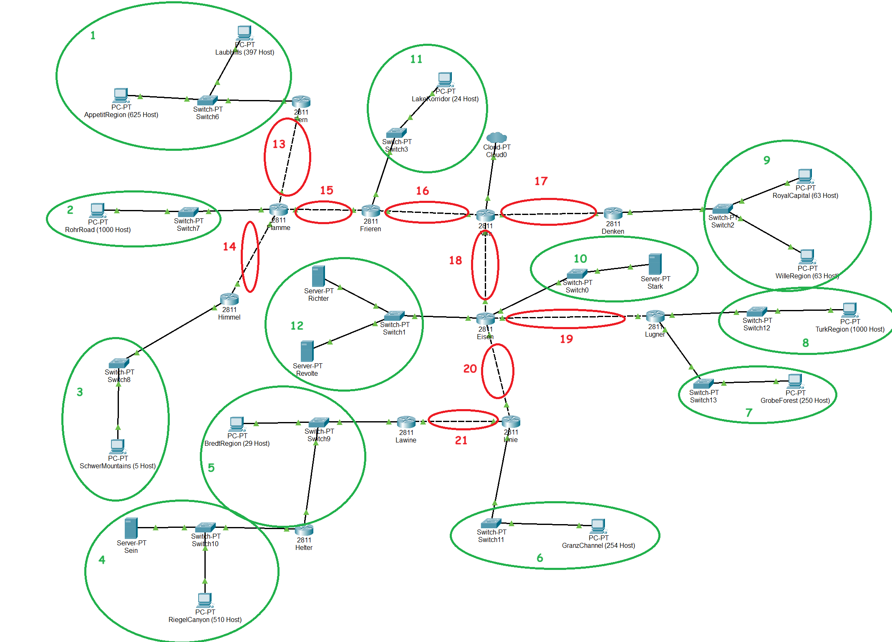
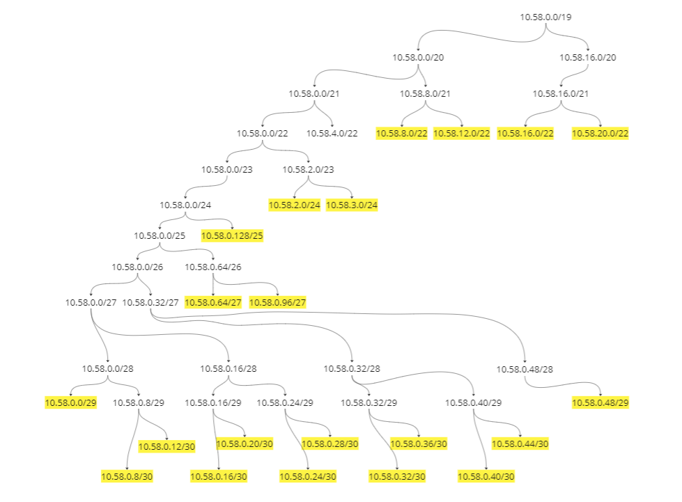
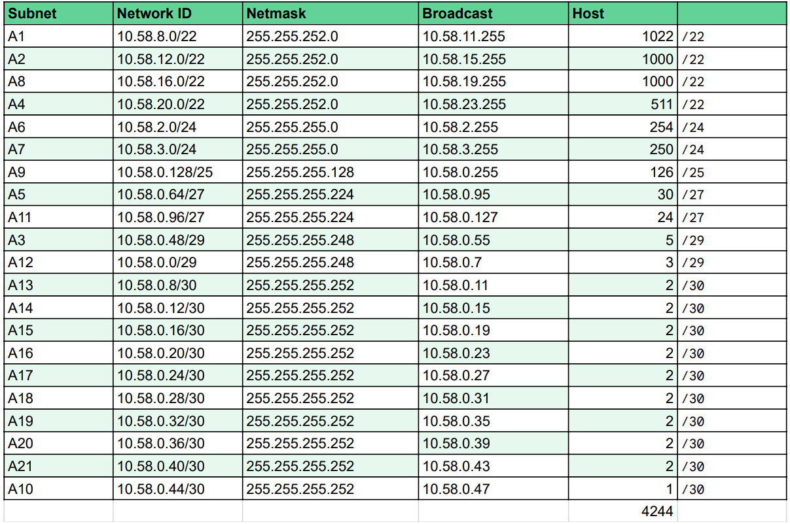

# Jarkom-Modul-4-F13-2023

| **No** | **Nama**                         | **NRP**    |
| ------ | -------------------------------- | ---------- |
| 1      | Helmi Abiyu Mahendra             | 5025211061 |
| 2      | Muhammad Naufal Fawwaz Ramadhan  | 5025211223 |


--------------------------------
# Laporan Resmi

Penggunaan metode subnetting ``VLSM``  pada ``Cisco Packet Tracer`` dan ``CIDR`` pada  ``GNS3``

## VLSM

Pembagian IP dengan VLSM (Variable Length Subnet Mask) adalah teknik yang memungkinkan pembagian subnet dengan ukuran yang bervariasi, sesuai dengan kebutuhan jaringan. Dalam VLSM, subnet yang lebih besar dibagi menjadi subnet yang lebih kecil untuk memanfaatkan alamat IP secara efisien. Hal ini memungkinkan penggunaan subnet mask yang berbeda untuk setiap subnet, sehingga memaksimalkan jumlah alamat IP yang tersedia dan mengurangi pemborosan.

Untuk langkah awalnya, jumlah host yang ada pada jaringan akan dihitung, dan kemudian ditentukan ``/`` terkecil yg mampu menampung semua host tersebut. 

untuk kasus kali ini digunakan subnet /19 sebagai dasarnya.
untuk tabel kapasitas subnet adalah sebagai berikut


## Topologi VLSM CPT

Berikut topologi jaringan yang kami gunakan dalam Cisco packcet tracer



## Pembagian IP

Prefix IP kelompok F13 adalah ``10.58``
Untuk melakukan efisiensi pembagian IP, prosesnya dapat digambarkan dalam tree sebagai berikut



Dan hasil lebih jelasnya tersaji pada tabel



## Konfigurasi Jaringan

### Router

#### Aura
Click node >> ```Config``` >> ``Interface``
```
FE 0/1
IP Address  : 10.58.0.25
Netmask     : 255.255.255.252
```
```
FE 1/0
IP Address  : 10.58.0.29
Netmask     : 255.255.255.252
```
```
FE 1/1
IP Address  : 10.58.0.21
Netmask     : 255.255.255.252
```
Masih di dalam ``Config``>>``Routing``>>``Static``
```
NetID    : 10.58.0.128
Netmask  : 255.255.255.128
Next Hop : 10.58.0.26
```
```
NetID    : 10.58.0.44
Netmask  : 255.255.255.252
Next Hop : 10.58.0.30
```
```
NetID    : 10.58.0.0
Netmask  : 255.255.255.248
Next Hop : 10.58.0.30
```
```
NetID    : 10.58.0.36
Netmask  : 255.255.255.252
Next Hop : 10.58.0.30
```
```
NetID    : 10.58.0.32
Netmask  : 255.255.255.252
Next Hop : 10.58.0.30
```
```
NetID    : 10.58.0.96
Netmask  : 255.255.255.224
Next Hop : 10.58.0.22
```
#### Frieren
Click node >> ```Config``` >> ``Interface``
```
FE 0/0
IP Address  : 10.58.0.22
Netmask     : 255.255.255.252
```
```
FE 1/0
IP Address  : 10.58.0.97
Netmask     : 255.255.255.224
```
```
FE 1/1
IP Address  : 10.58.0.17
Netmask     : 255.255.255.252
```
Masih di dalam ``Config``>>``Routing``>>``Static``
```
NetID    : 10.58.0.8
Netmask  : 255.255.255.252
Next Hop : 10.58.0.18
```
```
NetID    : 10.58.0.12
Netmask  : 255.255.255.252
Next Hop : 10.58.0.18
```
```
NetID    : 10.58.12.0
Netmask  : 255.255.252.0
Next Hop : 10.58.0.18
```
```
NetID    : 0.0.0.0
Netmask  : 0.0.0.0
Next Hop : 10.58.0.21
```
#### Flamme
Click node >> ```Config``` >> ``Interface``
```
FE 0/0
IP Address  : 10.58.0.18
Netmask     : 255.255.255.252
```
```
FE 0/1
IP Address  : 10.58.0.9
Netmask     : 255.255.255.252
```
```
FE 1/0
IP Address  : 10.58.12.1
Netmask     : 255.255.252.0
```
```
FE 1/1
IP Address  : 10.58.0.13
Netmask     : 255.255.255.252
```
Masih di dalam ``Config``>>``Routing``>>``Static``
```
NetID    : 10.58.8.0
Netmask  : 255.255.252.0
Next Hop : 10.58.0.10
```
```
NetID    : 10.58.0.48
Netmask  : 255.255.255.248
Next Hop : 10.58.0.14
```
```
NetID    : 0.0.0.0
Netmask  : 0.0.0.0
Next Hop : 10.58.0.21
```
#### Fern 
Click node >> ```Config``` >> ``Interface``
```
FE 0/0
IP Address  : 10.58.0.10
Netmask     : 255.255.255.252
```
```
FE 0/1
IP Address  : 10.58.8.1
Netmask     : 255.255.252.0
```
Masih di dalam ``Config``>>``Routing``>>``Static``
```
NetID    : 0.0.0.0
Netmask  : 0.0.0.0
Next Hop : 10.58.0.9
```
#### Himmel
Click node >> ```Config``` >> ``Interface``
```
FE 0/0
IP Address  : 10.58.0.14
Netmask     : 255.255.255.252
```
```
FE 0/1
IP Address  : 10.58.0.49
Netmask     : 255.255.255.248
```
Masih di dalam ``Config``>>``Routing``>>``Static``
```
NetID    : 0.0.0.0
Netmask  : 0.0.0.0
Next Hop : 10.58.0.13
```
#### Denken
Click node >> ```Config``` >> ``Interface``
```
FE 0/0
IP Address  : 10.58.0.26
Netmask     : 255.255.255.252
```
```
FE 0/1
IP Address  : 10.58.0.129
Netmask     : 255.255.255.128
```
Masih di dalam ``Config``>>``Routing``>>``Static``
```
NetID    : 0.0.0.0
Netmask  : 0.0.0.0
Next Hop : 10.58.0.25
```
#### Eisen
Click node >> ```Config``` >> ``Interface``
```
FE 0/0
IP Address  : 10.58.0.30
Netmask     : 255.255.255.252
```
```
E 1/0
IP Address  : 10.58.0.48
Netmask     : 255.255.255.252
```
```
E 1/1
IP Address  : 10.58.0.33
Netmask     : 255.255.255.252
```
```
E 1/2
IP Address  : 10.58.0.37
Netmask     : 255.255.255.252
```
```
E 1/3
IP Address  : 10.58.0.1
Netmask     : 255.255.255.248
```
Masih di dalam ``Config``>>``Routing``>>``Static``
```
NetID    : 0.0.0.0
Netmask  : 0.0.0.0
Next Hop : 10.58.0.29
```
```
NetID    : 10.58.2.0
Netmask  : 255.255.255.0
Next Hop : 10.58.0.38
```
```
NetID    : 10.58.0.40
Netmask  : 255.255.255.252
Next Hop : 10.58.0.38
```
#### Lugner
Click node >> ```Config``` >> ``Interface``
```
FE 0/0
IP Address  : 10.58.0.34
Netmask     : 255.255.255.252
```
```
FE 0/1
IP Address  : 10.58.16.1
Netmask     : 255.255.252.0
```
```
FE 1/0
IP Address  : 10.58.3.1
Netmask     : 255.255.255.0
```
Masih di dalam ``Config``>>``Routing``>>``Static``
```
NetID    : 0.0.0.0
Netmask  : 0.0.0.0
Next Hop : 10.58.0.33
```
#### Linie
Click node >> ```Config``` >> ``Interface``
```
FE 0/0
IP Address  : 10.58.0.38
Netmask     : 255.255.255.252
```
```
FE 0/1
IP Address  : 10.58.2.1
Netmask     : 255.255.255.0
```
```
FE 1/0
IP Address  : 10.58.0.41
Netmask     : 255.255.252.0
```
Masih di dalam ``Config``>>``Routing``>>``Static``
```
NetID    : 0.0.0.0
Netmask  : 0.0.0.0
Next Hop : 10.58.0.37
```
```
NetID    : 10.58.0.64
Netmask  : 255.255.255.224
Next Hop : 10.58.0.42
```
#### Lawine
Click node >> ```Config``` >> ``Interface``
```
FE 0/0
IP Address  : 10.58.0.42
Netmask     : 255.255.255.252
```
```
FE 0/1
IP Address  : 10.58.0.65
Netmask     : 255.255.255.224
```
Masih di dalam ``Config``>>``Routing``>>``Static``
```
NetID    : 0.0.0.0
Netmask  : 0.0.0.0
Next Hop : 10.58.0.41
```
```
NetID    : 10.58.0.22
Netmask  : 255.255.252.0
Next Hop : 10.58.0.66
```
#### Helter 
Click node >> ```Config``` >> ``Interface``
```
FE 0/0
IP Address  : 10.58.0.66
Netmask     : 255.255.255.224
```
```
FE 0/1
IP Address  : 10.58.20.1
Netmask     : 255.255.252.0
```
Masih di dalam ``Config``>>``Routing``>>``Static``
```
NetID    : 0.0.0.0
Netmask  : 0.0.0.0
Next Hop : 10.58.0.65
```
